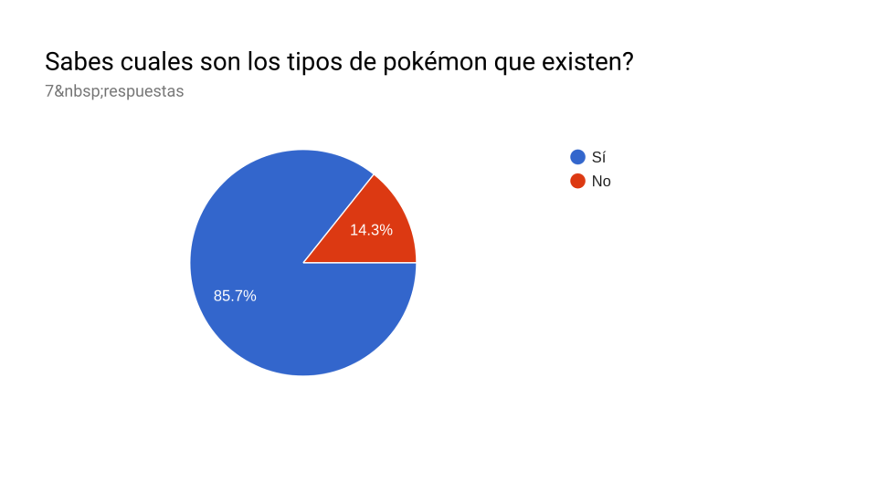
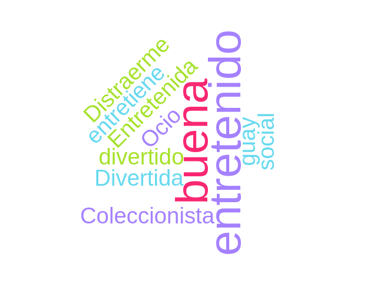
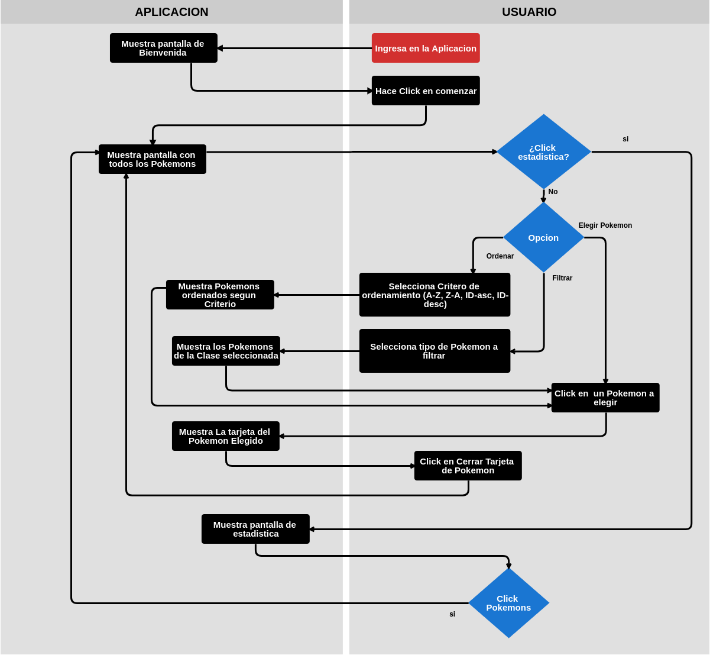
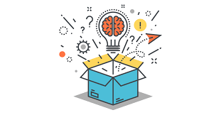
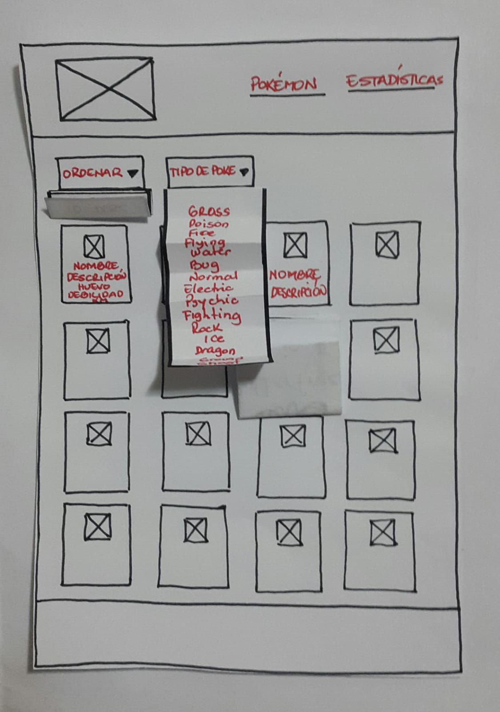
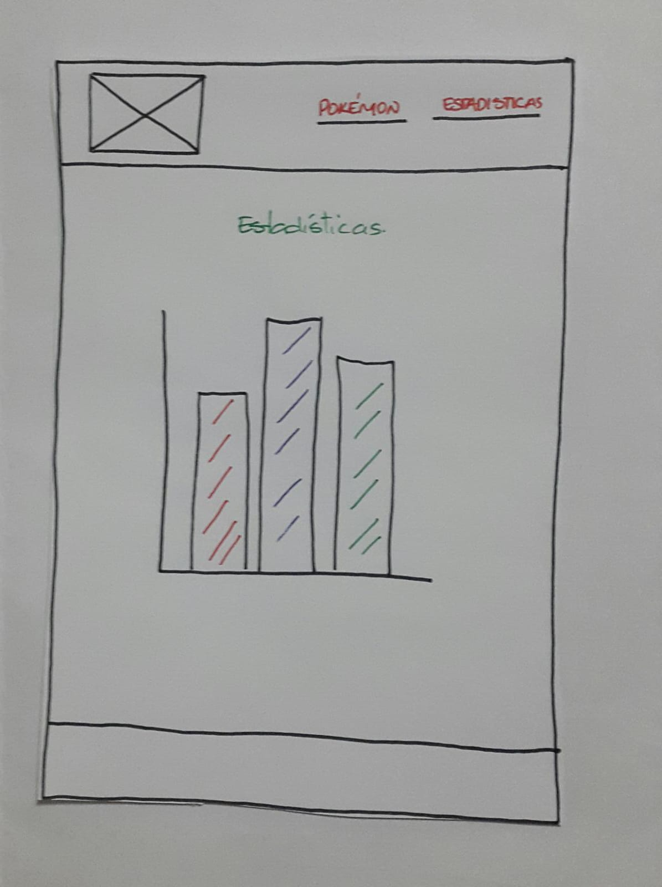

# POKE LAB GO

https://yrlanda.github.io/SCL008-data-lovers/

## Índice

* [Evolución de Pokémon Go](#evolución-de-pokémon-go)
* [Poke Lab Go](#poke-lab-go)
* [Definición del producto](#definición-del-producto)
* [Objetivos de aprendizaje](#objetivos-de-aprendizaje)
* [Parte obligatoria](#parte-obligatoria)
* [Parte opcional](#parte-opcional-hacker-edition)
* [Consideraciones técnicas](#consideraciones-técnicas)
* [Primeros pasos](#primeros-pasos)
* [Contenido de referencia](#contenido-de-referencia)
* [Checklist](#checklist)

***

## Evolución del Pokémon Go

A inicios del año 1996 en Japón, nace un videojuego más exitosos del mundo creado por Satoshi Tajiri. Pokémon. Pokémon.cuenta en la actalidad con más de 50 títulos. Entre los años 1989 y 1990, mucho antes del lanzamiento del primer juego de Pokémon, Tajiri diseñaba los primeros bocetos de lo que sería su obra maestra: un juego basado en coleccionar criaturas, las cuales podríamos usar en combate contra otros jugadores tanto en un mundo real como virtual. A sus criaturas las llamó “monstruos de bolsillo”, dado que el jugador podría atraparlas en unas bolas especiales que caben en la palma de la mano y llevarlos a todas partes en el bolsillo de un pantalón o mochila. La primera generación se llamó “Pocket Monsters”, y más tarde fue conocido sencillamente como Pokémon, uniendo las dos palabras.

Niantic Labs es una empresa de base tecnológica que fue creada dentro de Google y desarrollada por John Hanke, quien sin duda se puede definir como el padre de Pokemon Go. Y es que este emprendedor americano ha sido un visionario en cuanto a la realidad aumentada, una tecnología que deseaba aplicar a los videojuegos móviles.

Pokémon Go ha causado sensación desde el día de su lanzamiento, atrayendo a jóvenes y adultos a este nuevo mundo virtual por medio de la realidad aumentada. De acuerdo con el concepto original, los entrenadores buscan capturar Pokémon hasta completar una colección. El otro objetivo es adiestrarlos para que ganen batallas frente a otras criaturas.

## Definición del producto (Poke Lab Go)

Poke Lab Go es una aplicación dirigida a todos los fanáticos de Pokémon Go en forma de catálogo, ya que le permite tener un acceso rápido en la busqueda de sus pokémon y conocer más de ellos. En esta aplicación podrán filtrar y ordenar alfabeticamnete o a través dde su ID de una manera más rapipda y sencilla. Otro de los beneficios importantes que tiene la aplicación es que podŕas compartir ideas con tus amigos sobre tu pokémon ya que en esta encontrarás información detallada de cada uno de ellos. Descarga ya, tu catálogo en tu móvil y así obtienes lo que tanto has deseado saber sobre tus pokémon.

## Proceso del Diseño 

En el desarrollo del Reasearch fuimos evaluando y considerando cada uno de los criterios referidos por nuestros usuarios para el desarrollo de esta aplicación. A continuación se desglozan una serie de pautas que nos periten definir el producto: 

1. ¿Quiénes son los principales usuarios de producto?

Nuestros usuarios son especialmente los conocedores del juego, jugadores de Pokémon Go.

2. ¿Cuáles son los objetivos de los usuarios de esta aplicación?

Consultar de manera rápida información precisa sobre los pokémon que se encuentran en el juego.

3. ¿Que datos más relevantes se muestran en la interfaz?

Los usuarios requieren en la aplicación una busqueda sencilla de su pokémon y que se muestre información detallada del tipo al cual pertenece su debilidad, su caramelo, los km y su evolución.

4. ¿Cómo crees que el producto resuelve el problema que tiene tu usuario?

Poke Lab Go es una aplicación simple, ideal para usar desde el dispositivo móvil. La solución perfecta que necesitan los usuario para acceder fácilmente a toda informacion específica sobre los pokémon que se encuentran en el juego Pokémon Go.

5. ¿Cuándo utilizan o utilizarían el producto?

Antes de iniciar una partida y deseen consultar información de un pokémon en específico o cuando esten jugando.

## Planificación del proyecto

Con trello se llevo de manera más detallada la planifición del desarrrollo de la app [Trello](https://trello.com) el cual se pueden encontrar [aquí](https://trello.com/b/Jlp69tCA/poke-lab-go)

### Historias de usuario

1. Usuario 1

Como: Jugador de pokémon.

Quiero: ver todos los pokémon que existen

Para: poder escoger el de mi preferencia.

CRITERIOS DE ACEPTACIÓN

* La aplicación debe tener un botón que le permita al usuario ver todos los pokémon

* La aplicación debe mostrar cada pokémon  con su nombre  y una información detallada que le permita al usuario seleccionar el de su preferencia.

2. Usuario 2

Como: Jugador de Pokémon.

Quiero: ver los Pokémon ordenados.

Para: que mi busqueda sea más rapida.

CRITERIOS DE ACEPTACIÓN 

* La app debe tener un botón que al usuario darle click le permita visualizar todos los pokémon

*  La app debe tener un botón que le permita al usuario poder ordenar los pokémones alfabéticamente.

*  El usuario debe poder tener la opción de escoger el pokemón que desee para que su busqueda sea más rapida.

3. Usuario 3

Como: Jugador de pokémon.

Quiero: ver los pokémon según su tipo.

Para: saber que pokémon hay por cada tipo.

CRITERIOS DE ACEPTACIÓN

* La app debe tener un botón que permita al usuario poder filtrar según el tipo de pokémon.

* La app debe mostrar los pokémon según al tipo al que pertenezca.

*  La app debe tener una opción que le permita al usuario volver a ver todos los pokémones.

4. Usuario 4

Como: Jugador de Pokémon.

Quiero: ver el tipo de caramelo que tiene cada pokémon

Para: hacer evolucionar mi pokémon.

CRITERIOS DE ACEPTACIÓN
 
*  La aplicación debe tener un botón que le permita al usuario ver todos los pokémon.

*  La aplicación debe mostrar cada pokémon  con su nombre  y una información detallada que le permita al usuario seleccionar el de su preferencia.

*  La información debe incluir el tipo de caramelo por pokémon para que el usuario sepa que tipo de caramelo necesita para evolucionar

5. Usuario 5

Como: Jugador de pokémon.

Quiero: saber cual es la debilidad de mi pokémon

Para: estar preparado en el momento de iniciar mi juego.

CRITERIOS DE ACEPTACIÓN 

* La aplicación debe tener un botón que le permita al usuario ver todos los pokémon.

* La aplicación debe mostrar cada pokémon  con su nombre  y una información detallada que le permita al usuario seleccionar el de su preferencia.

* La información debe incluir la debilidad por cada pokémon para que el usuario sepa contra que tipos de pokémon se enfrentara.

### Encuesta aplicada

Se realizó una encuesta con el Formulario de Google Forms, con el objetivo de conocer un poco más sobre los jugadores de Pokémon Go, que fue compartida a través de vaarias redes sociales, recibiendo un total de 17 respuestas.

La encuesta se realizó con [Google](https://docs.google.com)  el cual se pueden encontrar [aquí](https://docs.google.com/spreadsheets/d/1sfovsX3TTzw9UGcx3pIXZJRC2Lfl_Flr9pJjH2EgBR4/edit#gid=1489781696)

Cuando le preguntamos por qué juegan pokémon estas fueron su respuestas 

## Definición del Usuario (User persona o Buyer persona)

 Este perfil representa un personaje real extraído a través de informaciones de personas que potencialmente son jugadores de Pokémon para los cuales esta orientada la aplicación de Poke Lab Go, donde podrán recopilar información necesaria para los ojetivos de sus partidas.

El User persona se elaboró con [Figma](https://figma.com)  el cual se pueden encontrar [aquí]
(https://www.figma.com/proto/eQAInpAP5qIrILcLgckiWc5E/User-persona-(POKE-LAB-GO)?node-id=1%3A3&scaling=min-zoom)

### Diagrama de Flujo 

Aca se puede observar de una manera más detallada la interacción del usuario con la aplicación.

## Ideación 

#### Prototipo de baja fidelidad 

Inicialmente se elabora prototipado de baja fidelidad para su uso en test y sesiones de diseño participativo, con la idea es conseguir una gran cantidad de información de la interacción entre la interfaz y el usuario mediante la evaluación de este prototipo. Dado que los prototipos de baja fidelidad son baratos, tanto en términos de dinero como de tiempo, es posible obtener una serie de información de manera rápida y fácil.

Al testear nuestro prototipo de baja fidelidad se pudo obserar que los usuarios marcaban fácilmente los botones que eran indicativos como para lograr la tarea dada, esta constaba de seleccionar un tipo de pokémon y su resultado fue muy fluido.

## Prototipado

#### Wireframe

En el siguiente wireframe se muestra una aproximación más tangible de las funcionalidades de la app y de la misma forma impulsar el proceso de diseño de la interfaz de usuario (UI). Los diseñadores de experiencia de usuario y arquitectos de información usan wireframes para mostrar las rutas de navegación entre páginas. 

Los wireframe se realizaron con [Figma](https://figma.com)  los cuales se pueden encontrar [aquí](https://www.figma.com/file/OG0qwA2ncQfYkenZ5KQmA9dW/Pokemon-Go-wireframe?node-id=0%3A9)

Se realizó un testeo a un usuario de PokemonGo nivel intermedio para poder visualizar si los prototipos están funcionando correctamente. En el testeo se pudo concluir que se debían realizar ciertos cambios y mejoras, así como tambien corroborar elementos bien desarrollados en el prototipo generado, el video lo puedes encontrar  [aquí](https://www.youtube.com/watch?v=XMweLVhwZPg&feature=youtu.be)

#### Mockup#######

El prototipo de Baja fidelidad se elaboró con  [Figma](https://figma.com)  el cuale se pueden encontrar [aquí](https://www.figma.com/proto/XGVn7L1iotKpgfis1PLRN30y/poke-lab-go-baja-fidelidad?node-id=1%3A2&scaling=min-zoom)

#### Prototipo de alta fidelidad

El prototipo de Alta fidelidad se elaboró con [Figma](https://figma.com) el cual se pueden encontrar [aquí](https://www.figma.com/proto/YamVV28vR5MVltYHeoCnYyX6/poke-lab-go-alta-fidelidad?node-id=2%3A11&scaling=min-zoom)

Se realizaron testeos de usabilidad con los usuarios los cuales indicaron que el titulo de la app les resultada dificil de leer por lo que se realizaron mejoras al final.

## Test de usabilidad

Se realizaron testeos a usuarios con la página terminada para poder analizar si es necesario aplicar algún cambio y mejora en la app. Puedes verlo [aquí](https://www.youtube.com/watch?v=4cgICV6RIIo&feature=youtu.be)

### Feedback de Experto

El día 06 de Marzo se recibe Feedback de experto el cual indica

* La pagina principal de la aplicación al interactuar en ella por su diseño le dio la sensación de que habia más información en la parte de abajo

* Indica que en el select donde se muestran todos los tipos de pokémon deberian verse de una vez ordenada, por lo que se realiza modificación en el pokemon.html

* Sugiere en el link de estadisticas convertirlo en un select también.

* Indica por último que le resulta armonioza la aplicación por la paleta de colores usadas

### General

| Característica/Habilidad |
|--------------------------|
| Completitud |

### Tech

| Habilidad |
|-----------|
| **JavaScript** |
| Estilo |
| Nomenclatura/semántica |
| Funciones/modularidad |
| Estructuras de datos |
| Tests |
| **HTML** |
| Validación |
| Estilo |
| Semántica |
| **CSS** |
| DRY |
| Responsive |
| **SCM** |
| Git |
| GitHub |
| **CS** |
| Lógica |
| Arquitectura |

### UX

| Habilidad |
|-----------|
| User Centricity |
| Visual Design |

### Habilidades Blandas

| Habilidad |
|-----------|
| Planificación y organización |
| Autoaprendizaje |
| Solución de problemas |
| Dar y recibir feedback |
| Adaptabilidad |
| Trabajo en equipo |
| Comunicación eficaz |
| Presentaciones |

***

## Checklist

* [X] Usa VanillaJS.
* [X] No hace uso de `this`.
* [X] Pasa linter (`npm pretest`)
* [X] Pasa tests (`npm test`)
* [X] Pruebas unitarias cubren un mínimo del 70% de statements, functions y
  lines y branches.
* [X] Incluye _Definición del producto_ clara e informativa en `README.md`.
* [X] Incluye historias de usuario en `README.md`.
* [X] Incluye _sketch_ de la solución (prototipo de baja fidelidad) en
  `README.md`.
* [X] Incluye _Diseño de la Interfaz de Usuario_ (prototipo de alta fidelidad)
  en `README.md`.
* [ ] Incluye link a Zeplin en `README.md`.
* [X] Incluye el listado de problemas que detectaste a través de tests de
  usabilidad en el `README.md`.
* [X] UI: Muestra lista y/o tabla con datos y/o indicadores.
* [X] UI: Permite ordenar data por uno o más campos (asc y desc).
* [X] UI: Permite filtrar data en base a una condición.
